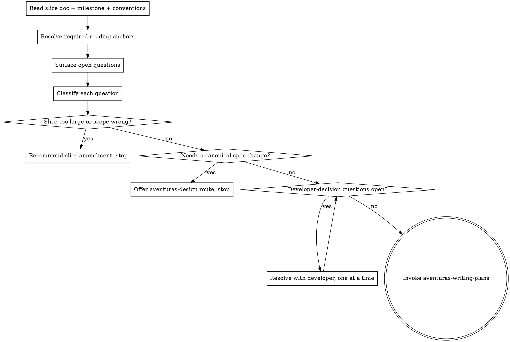

<!-- Adapted from Superpowers (https://github.com/obra/superpowers), MIT-licensed. See .agents/skills/NOTICE-superpowers.md. -->

# Brainstorming a Slice Into Implementation Questions

Take an approved slice doc and iron out every open implementation question with the developer before any code is written. The slice doc is the contract; this skill resolves what the contract leaves open, then hands off to aventuras-writing-plans.

This is not design work. Product and architecture decisions already live in the canonical specs and the slice doc. This skill resolves _implementation_ questions — the choices, ambiguities, and underspecified seams a slice doc intentionally leaves to the implementing developer.

<HARD-GATE>
Do NOT invoke aventuras-writing-plans, write any code, or take any implementation action until every developer-decision open question has been resolved with the developer. This applies to EVERY slice regardless of perceived simplicity.
</HARD-GATE>

## Anti-Pattern: "This Slice Is Too Simple To Need Planning"

Every slice goes through this process. A config-only slice, a one-table migration, a single component — all of them. "Simple" slices are where unexamined assumptions cause the most wasted work. If a slice genuinely has no open questions, this skill is fast: confirm that with the developer, then hand off. But you MUST check first.

## Checklist

You MUST create a task for each of these items and complete them in order:

1. **Read the slice doc** — and its parent milestone doc and `docs/implementation/conventions.md`
2. **Resolve required reading** — open every Required-reading anchor at its named section, not just the file
3. **Surface open questions** — the slice doc's Open questions section, plus any underspecified seam you find while reading
4. **Classify each question** — developer-decision, implementer-choice, monitor-during-work, or blocker
5. **Resolve developer-decisions** — one question at a time, with the developer
6. **Check slice size and scope** — if the slice is too large for one PR, or its scope is wrong, stop and recommend an amendment
7. **Transition to planning** — invoke aventuras-writing-plans

## Process Flow

**The terminal state is invoking aventuras-writing-plans.** Do NOT invoke any other skill, and do NOT start writing code.

## The Process

**Reading the slice:**

- Read the target slice doc first: Goal, Scope in/out, Acceptance criteria, Tests, Open questions.
- Read the parent milestone doc for the dependency graph and any slice contracts.
- Open every Required-reading anchor at its named section. The slice doc paraphrases for orientation; the canonical doc is authoritative — read the canonical section, not just the paraphrase.
- Note dependency slices. If the slice depends on unmerged work, surface that to the developer.

**Surfacing open questions:**

- Start from the slice doc's Open questions section.
- Add what you find while reading: an acceptance criterion with no clear verification path, a module seam the slice doc doesn't pin, a type or interface the slice needs but no doc defines, behavior the canonical spec leaves ambiguous.
- An open question is anything an autonomous coding pass would otherwise resolve silently by guessing.

**Classifying questions:**

Use the taxonomy from `docs/implementation/conventions.md` → Slice planning. That doc is the source of truth; follow it if it changes.

- **Developer-decision** — a choice the slice cannot safely make alone. MUST be answered before handoff.
- **Implementer-choice** — the implementer may decide; record the sensible default so it is not silently reinterpreted later.
- **Monitor-during-work** — a known risk with no decision yet; the plan flags it for attention during implementation.
- **Blocker** — planning cannot finish until something external is resolved.

**Resolving developer-decisions:**

- Ask one question at a time. Don't overwhelm with a long interrogation.
- Prefer multiple choice. When a question has more than one viable resolution, present the options with trade-offs and lead with your recommendation and reasoning.
- Be flexible — go back and re-read if an answer doesn't fit what the docs say.

**Checking slice size and scope:**

- If resolving the questions reveals the slice is too large for one PR, stop. Recommend a slice split to the developer — don't plan an oversized slice.
- If the route would cross the slice's Scope: out, or the slice contract itself looks wrong, stop and recommend a slice-doc amendment. Slice and milestone docs are developer-authored; recommend, don't rewrite.

## When a Slice Needs a Canonical Spec Change

Ironing out a question sometimes reveals the slice can't be done correctly without changing a canonical spec (`data-model.md`, `architecture.md`, a UI doc) — a real product or architecture decision, not an implementation choice.

When that happens: STOP. Do not change the canonical doc. Do not guess. Offer the developer the design route:

> "Resolving <question> needs a canonical spec decision, not an implementation choice: <one-line statement of the decision>. That belongs in an aventuras-design session, which settles the canonical doc through its own review and integration gate. Want to switch to aventuras-design for this, or handle it another way?"

Wait for the developer's answer. Do NOT invoke aventuras-design yourself — the developer owns that transition.

## Transition to Planning

Once every developer-decision question is resolved:

- Confirm with the developer that the open questions are settled.
- Invoke aventuras-writing-plans. It consumes the slice doc and the decisions resolved here, and writes the execution plan to `.impl-plans/`.
- Do NOT invoke any other skill. aventuras-writing-plans is the next step.

This skill writes no file of its own. The resolved decisions flow into aventuras-writing-plans, which owns the durable artifact.

## Key Principles

- **One question at a time** — don't overwhelm with multiple questions
- **Multiple choice preferred** — easier to answer than open-ended when possible
- **The slice doc is the contract** — resolve what it leaves open; don't redesign what it already settles
- **Don't silently decide** — a developer-decision question guessed is a wrong implementation
- **Canonical specs are gated** — a spec change is an aventuras-design offer, never a silent edit
- **Be flexible** — go back and re-read when an answer doesn't fit
