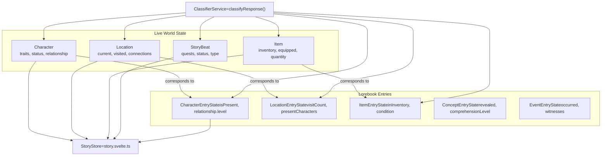

# World State
  

This Mermaid diagram represents a flowchart showing relationships between:
1. Live World State entities (Character, Location, Item, StoryBeat)
2. Lorebook Entry states (CharEntry, LocEntry, ItemEntry, etc.)
3. A ClassifierService that connects to all entities
4. A StoryStore that receives information from all entities

The diagram shows how these components interact in what appears to be a game or narrative system architecture.
